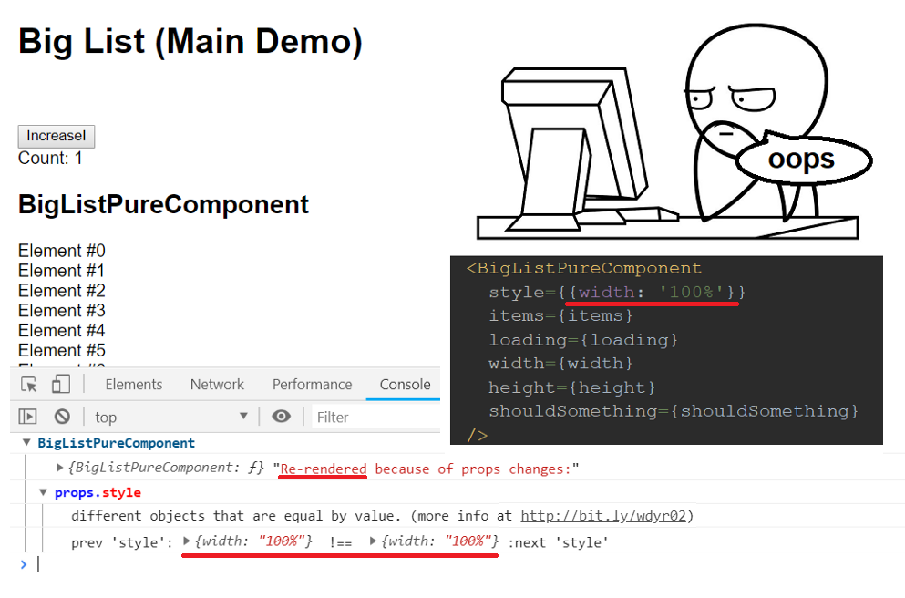
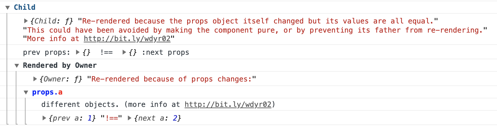

# Why Did You Render

[](https://badge.fury.io/js/%40welldone-software%2Fwhy-did-you-render)
[](https://travis-ci.com/welldone-software/why-did-you-render)


[](https://coveralls.io/github/welldone-software/why-did-you-render?branch=add-e2e-tests-using-cypress)

`why-did-you-render` by [Welldone Software](https://welldone.software) monkey patches **`React`** to notify you about avoidable re-renders. (Works with **`React Native`** as well.)

For example, when you pass `style={{width: '100%'}}` to a big pure component and make it always re-render:



It can also help you to simply track when and why a certain component re-renders.

## Setup
The last version of the library has been tested with **`React@16.13.1`** but it is expected to work with all `React@16` versions.

> For versions before 16.8 try turning off hooks support by using `trackHooks: false` in `whyDidYouRender`'s init options.*

```
npm install @welldone-software/why-did-you-render --save
```

## Installation
Execute `whyDidYouRender` **as the first thing that happens in your application** (even before `react-hot-loader`).

The best way of doing this would be to create a file (lets say `wdyr.js`) near the entrypoint of your application:

`wdyr.js`:
```jsx
import React from 'react';

if (process.env.NODE_ENV === 'development') {
  const whyDidYouRender = require('@welldone-software/why-did-you-render');
  whyDidYouRender(React, {
    trackAllPureComponents: true,
  });
}
```
And then import `wdyr.js` (even before `react-hot-loader`):

`index.js`:
```jsx
import './wdyr';

import 'react-hot-loader';
import {hot} from 'react-hot-loader/root';

import React from 'react';
import ReactDOM from 'react-dom';
// ...
import {App} from './app';

// ...
const HotApp = hot(App);
// ...
ReactDOM.render(<HotApp/>, document.getElementById('root'));
```

If you use the latest `react-redux` with hooks (or any other custom library), you can also patch it like this:
```js
import React from 'react';

if (process.env.NODE_ENV === 'development') {
  const whyDidYouRender = require('@welldone-software/why-did-you-render');
  const ReactRedux = require('react-redux');
  whyDidYouRender(React, {
    trackAllPureComponents: true,
    trackExtraHooks: [
      [ReactRedux, 'useSelector']
    ]
  });
}
```
But there is currently a problem with rewriting exports of imported files in `webpack` and a small workaround should be applied to support this feature [#85 - trackExtraHooks cannot set property](https://github.com/welldone-software/why-did-you-render/issues/85)

## Read More
* [Why Did You Render Mr. Big Pure React Component???](http://bit.ly/wdyr1)
* [**Common fixing scenarios** this library can helps with](http://bit.ly/wdyr02)
* [**React Hooks** - Understand and fix hooks issues](http://bit.ly/wdyr3)
* [Why Did You Render v4 Released!](https://medium.com/welldone-software/why-did-you-render-v4-released-48e0f0b99d4c) - TypeScript support, Custom hooks tracking (like React-Redux’s useSelector), Tracking of all pure components.

## Integration With Other Libraries
* [Next.js example](https://github.com/zeit/next.js/tree/canary/examples/with-why-did-you-render)
* [React-Redux With Hooks](https://medium.com/welldone-software/why-did-you-render-v4-released-48e0f0b99d4c)

## Sandbox
You can test the library in [the official sandbox](http://bit.ly/wdyr-sb).

And another [official sandbox with hooks tracking](https://codesandbox.io/s/why-did-you-render-sandbox-with-hooks-pyi14)

## Tracking Components
You can track all pure components (components that are extending [React.PureComponent](https://reactjs.org/docs/react-api.html#reactpurecomponent), or function components that are wrapped with [React.memo](https://reactjs.org/docs/react-api.html#reactmemo)) using the `trackAllPureComponents: true` option.

You can also manually track any component you want by setting `whyDidYouRender` on them like this:
```js
class BigList extends React.Component {
  static whyDidYouRender = true
  render(){
    return (
      //some heavy render you want to ensure doesn't happen if its not necessary
    )
  }
}
```

And for functional components:

```js
const BigListPureComponent = props => (
  <div>
    //some heavy component you want to ensure doesn't happen if its not necessary
  </div>
)
BigListPureComponent.whyDidYouRender = true
```

You can also pass an object to specify more advanced tracking settings:

```js
EnhancedMenu.whyDidYouRender = {
  logOnDifferentValues: true,
  customName: 'Menu'
}
```

- `logOnDifferentValues`:

  Normally, only re-renders that are caused by equal values in props / state trigger notifications:
  ```js
  render(<Menu a={1}/>)
  render(<Menu a={1}/>)
  ```
  This option will trigger notifications even if they occurred because of different props / state (Thus, because of "legit" re-renders):
  ```js
  render(<Menu a={1}/>)
  render(<Menu a={2}/>)
  ```

- `customName`:

  Sometimes the name of the component can be very inconvenient. For example:

  ```js
  const EnhancedMenu = withPropsOnChange(withPropsOnChange(withStateHandlers(withPropsOnChange(withState(withPropsOnChange(lifecycle(withPropsOnChange(withPropsOnChange(onlyUpdateForKeys(LoadNamespace(Connect(withState(withState(withPropsOnChange(lifecycle(withPropsOnChange(withHandlers(withHandlers(withHandlers(withHandlers(Connect(lifecycle(Menu)))))))))))))))))))))))
  ```

  will have the display name:

  ```js
  withPropsOnChange(withPropsOnChange(withStateHandlers(withPropsOnChange(withState(withPropsOnChange(lifecycle(withPropsOnChange(withPropsOnChange(onlyUpdateForKeys(LoadNamespace(Connect(withState(withState(withPropsOnChange(lifecycle(withPropsOnChange(withHandlers(withHandlers(withHandlers(withHandlers(Connect(lifecycle(Menu)))))))))))))))))))))))
  ```

  To prevent polluting the console, and any other reason, you can change it using `customName`.

## Options
Optionally you can pass in `options` as the second parameter. The following options are available:
- `include: [RegExp, ...]` (`null` by default)
- `exclude: [RegExp, ...]` (`null` by default)
- `trackAllPureComponents: false`
- `trackHooks: true`
- `trackExtraHooks: []`
- `logOnDifferentValues: false`
- `logOwnerReasons: false`
- `hotReloadBufferMs: 500`
- `onlyLogs: false`
- `collapseGroups: false`
- `titleColor`
- `diffNameColor`
- `diffPathColor`
- `notifier: ({Component, displayName, prevProps, prevState, nextProps, nextState, reason, options}) => void`

#### include / exclude
You can include or exclude tracking for re-renders for components
by their displayName with the `include` and `exclude` options.

*Notice: **exclude** takes priority over both `include` and `whyDidYouRender` statics on components.*

For example, the following code is used to [track all redundant re-renders that are caused by React-Redux](http://bit.ly/wdyr04):
```js
whyDidYouRender(React, { include: [/^ConnectFunction/] });
```

#### trackAllPureComponents
You can track all pure components (both `React.memo` and `React.PureComponent` components)

*Notice: You can exclude the tracking of any specific component with `whyDidYouRender = false`.*

#### trackHooks
You can turn off tracking of hooks changes.

[Understand and fix hook issues](http://bit.ly/wdyr3).

#### trackExtraHooks
Adding extra hooks to track for "redundant" results:

```js
whyDidYouRender(React, {
  trackExtraHooks: [
    [ReactRedux, 'useSelector']
  ]
});
```

> There is currently a problem with rewriting exports of imported files in webpack.

> To see available workarounds check out the discussion at bug [#85 - trackExtraHooks cannot set property](https://github.com/welldone-software/why-did-you-render/issues/85)

#### logOnDifferentValues
Normally, you only want notifications about component re-renders when their props and state
are the same, because it means these re-renders could have been avoided. But you can also track
all re-renders, even on different state/props.

```js
render(<BigListPureComponent a={1}/>)
render(<BigListPureComponent a={2}/>)
// this will only cause whyDidYouRender notifications for {logOnDifferentValues: true}
```

#### logOwnerReasons
One way of fixing re-render issues is preventing the component's owner from re-rendering.
To make that easier, you can use `logOwnerReasons: true` to view the reasons why owner component re-renders.


#### hotReloadBufferMs
Time in milliseconds to ignore updates after a hot reload is detected.

We can't currently know exactly if a render was triggered by hot reload,
so instead, we ignore all updates for `hotReloadBufferMs` (default: 500) after a hot reload.

#### onlyLogs
If you don't want to use `console.group` to group logs by component, you can print them as simple logs.

#### collapseGroups
Grouped logs can start collapsed:

#### titleColor / diffNameColor / diffPathColor
Controls the colors used in the console notifications

#### notifier
You can create a custom notifier if the default one does not suite your needs.

## Troubleshooting

### `Class constructors must be invoked with 'new'`.
If you are building for latest browsers (or using es6 classes without building) you don't transpile the "class" keyword.

This causes an error because the library uses transpiled classes, and [transpiled classes currently can't extend native classes](https://github.com/welldone-software/why-did-you-render/issues/5).

To fix this, use the "no-classes-transpile" dist:
```js
import React from 'react';

if (process.env.NODE_ENV === 'development') {
  const whyDidYouRender = require('@welldone-software/why-did-you-render/dist/no-classes-transpile/umd/whyDidYouRender.min.js');
  whyDidYouRender(React);
}
```

### React-Redux `connect` HOC is spamming the console
Since `connect` hoists statics, if you add WDYR to the inner component, it is also added to the HOC component where complex hooks are running.

To fix this, add the `whyDidYouRender = true` static to a component after the connect:
```js
  const SimpleComponent = ({a}) => <div data-testid="foo">{a.b}</div>)
  // not before the connect:
  // SimpleComponent.whyDidYouRender = true
  const ConnectedSimpleComponent = connect(
    state => ({a: state.a})
  )(SimpleComponent)
  // after the connect:
  SimpleComponent.whyDidYouRender = true
```

## Credit

Inspired by the following previous work:

https://github.com/maicki/why-did-you-update which I had the chance to maintain for some time.

https://github.com/garbles/why-did-you-update where [A deep dive into React perf debugging](http://benchling.engineering/deep-dive-react-perf-debugging/) is credited for the idea.

## License

This library is [MIT licensed](./LICENSE).
